# Amazon Sagemaker

Amazon Sagemaker is a cloud machine learning platform that enables developers to build, train and deploy machine learning models quickly.

It is basically a service that enables developers to build and train machine learning models for predictive or analytical applications in 
the amazon web services public cloud.

Sagemaker have common built in machine learning algorithms along with other tools to simplify and accelerate the entire process

# Workflow

Sagemaker support Jupyter Notebook instance which are open source web application, that help developers share live code.
These notebook instance include driver packages and libraries for common machine learning platforms and frameworks.

Developers can launch a pre-built notebook which AWS supplies for variety of applications and use cases then customize according to the 
data set and schema the developers want to train.

Developers can also obviously use custom built algorithms written in one of the supported machine learning frameworks or any code that 
has been packaged as a docker container image.

Sagemaker can basically pull data from amazon Simple Storage Service (S3 Bucket), while training and testing machine learning models.
To get started a developer logs into sagemaker console and launches a notebook instance. Sagemaker here provides a variety of built in 
algorithms or the developers can import custom algorithms. When the developer is ready to train the model,he specifies the location of 
the data in S3 Bucket and preferred instance type and initiate the training process.

Sagemaker uses automatic model tuning to find the set of parameters also called as hyper parameters, that will optimize best result from 
the machine learning model.

When the model is finally ready to deploy, the service automatically operates and scales cloud infrastructure using a set of sagemaker instance
 types, that include with GPU accelerators and that have been optimized for machine learning workloads.

Sagemaker deploys across multiple availability zones, applies security patches, performs health checks, set up auto scaling and establishes
 secure https endpoints to connect to an application. A developer can track and trigger alarms for changes production performance by 
amazon cloud watch metrics.

# Steps To Be Followed

## Step 1. Create an Amazon SageMaker notebook instance

In this step, create the notebook instance that is use to download and process data. As part of the creation process, also create an Identity and Access Management (IAM) role that allows Amazon SageMaker to access data in Amazon S3.

a.Choose Notebook instances from Sagemaker, then choose Create notebook instance.

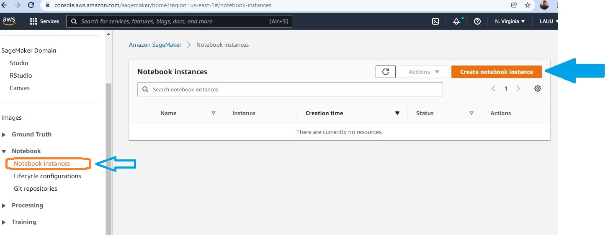

b.On the Create notebook instance page, in the Notebook instance setting box, fill the following fields:
       For Notebook instance name: type Sagemaker-XGBoost
       For Notebook instance type:choose ml.t2.medium.
       For Elastic inference: keep the default selection of none.

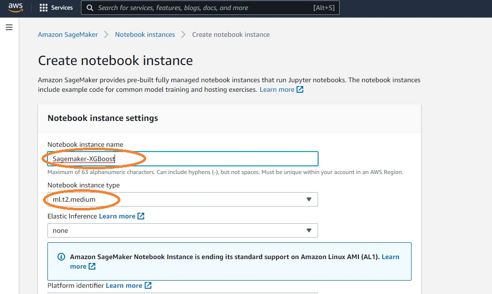

c.In the Permissions and encryption section, for IAM role, choose Create a new role, and in the Create an IAM role dialog box, select Any S3 bucket and choose Create role.

Note: If you already have a bucket that you’d like to use instead, choose Specific S3 buckets and specify the bucket name.

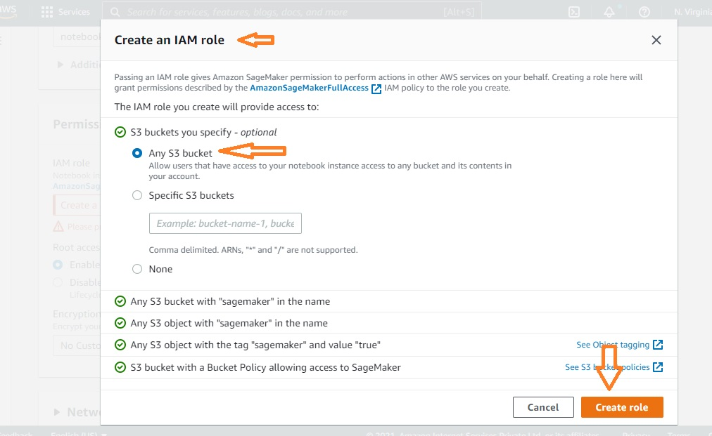

Amazon SageMaker creates the AmazonSageMaker-ExecutionRole-*** role. 

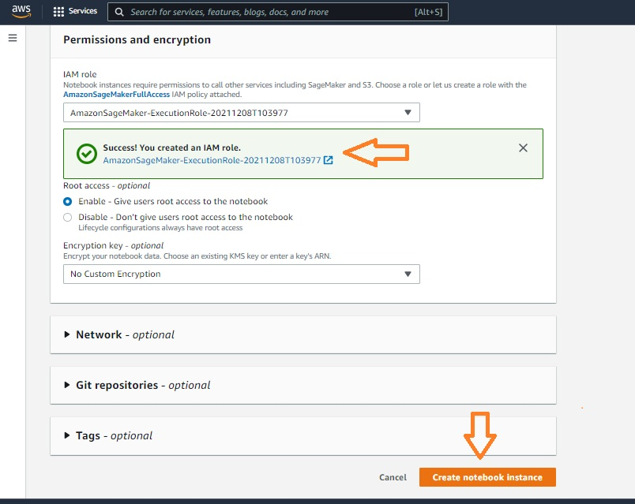

d.Keep the default settings for the remaining options and choose Create notebook instance.

In the Notebook instances section, the new Sagemaker-XGBoost notebook instance is displayed with a Status of Pending. The notebook is ready when the Status changes to InService.

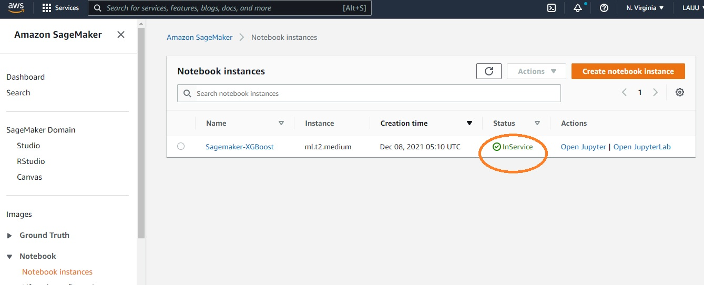

## Step 2. Prepare the data

In this step, use Amazon SageMaker notebook instance to preprocess the data that you need to train your machine learning model and then upload the data to Amazon S3.

a.After your SageMaker-Tutorial notebook instance status changes to InService, choose Open Jupyter.

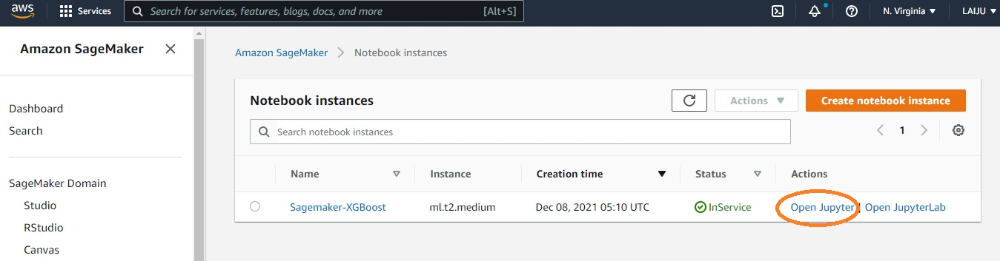

b.In Jupyter, choose New and then choose conda_python3.

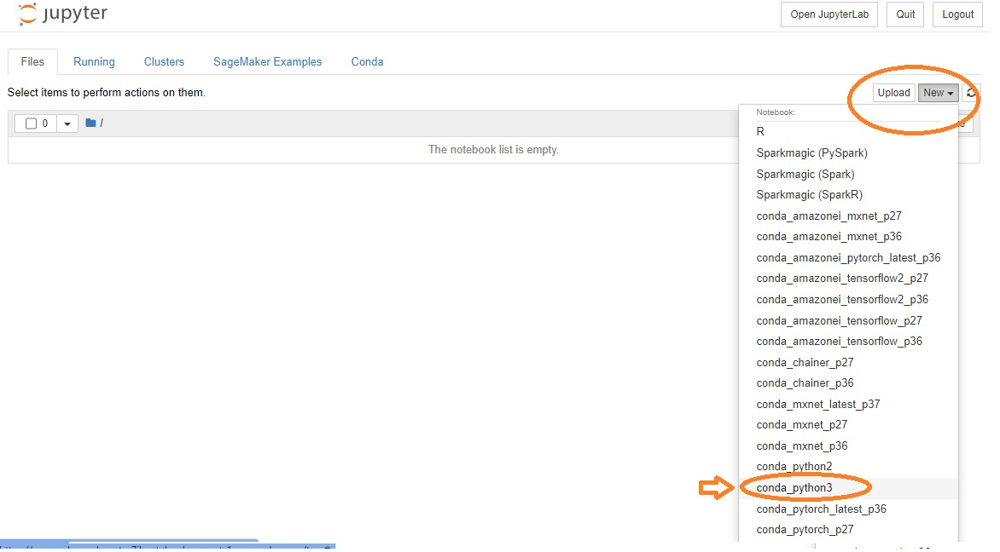

c.In code cell on Jupyter notebook, prepare the code.
The code imports the required libraries and defines the environment variables you need to prepare the data, train the ML model, 
and deploy the ML model.

d.Create the S3 bucket to store data
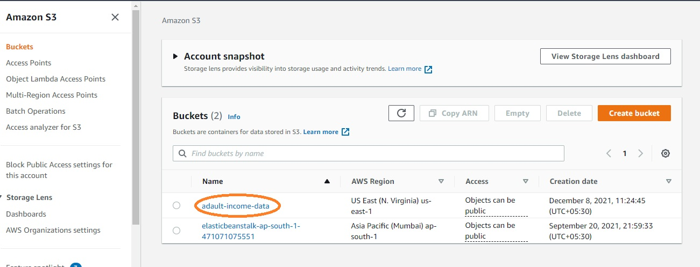

e.Create train, test, output object folders inside S3 and save train data, test data and trained machine learning model. 
Reformat the csv data before push into S3 objects, dependent feature should be the first coloumn.

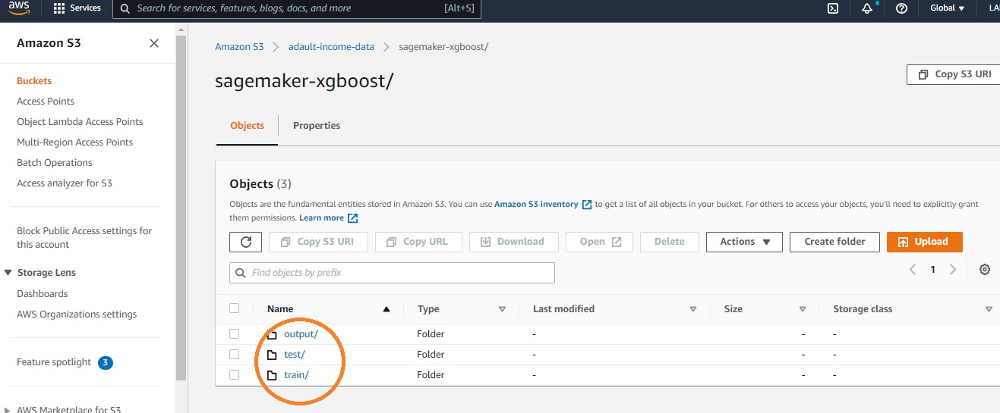

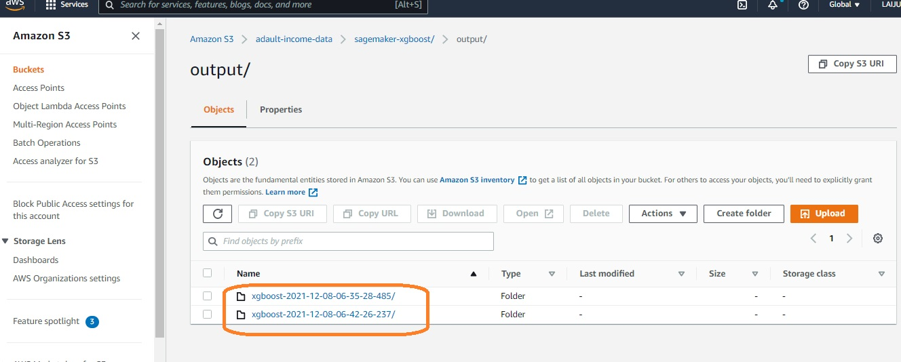

## Step 3. Train the ML model

In this step, use training dataset to train machine learning model.

a.Set up the Amazon SageMaker session, create an instance of the XGBoost model (an estimator), and define the model’s hyperparameters. 

b.Start the training job. Trains the model using a ml.m4.xlarge instance. 
After a few minutes, we should see the training logs being generated in Jupyter notebook.

Note : before training reformat the CSV data, dependent feature should be the first coloumn

## Step 4. Deploy the model

In this step, deploy the trained model to an endpoint, load the test CSV data from S3, then run the model to create predictions.

Deploys the model on a EC2 instance and creates a SageMaker endpoint that we can access. 

To predict with test data we use CSVSerializer

## Step 5. Evaluate model performance

In this step, evaluate the performance and accuracy of the machine learning model.

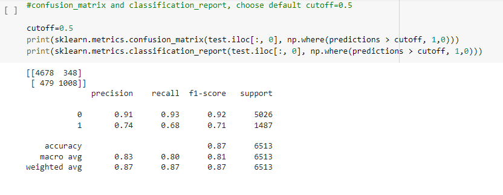

Based on the prediction, we can conclude that predicted results accuracy 87% (5686/6513)in the test data,
with a precision of 91% (4678/5157) for income < 50k and 74% (1008/1356) for income 50k.

### Plot Log loss vs Cutoff, and find exact Cutoff 

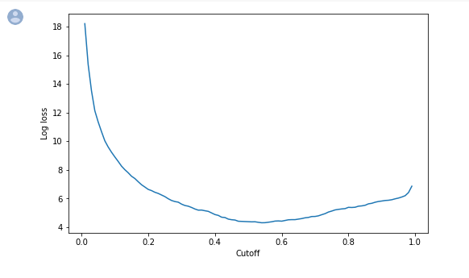

Cutoff value = 0.54 at minimum log loss value = 4.43

 
## Step 6. Generate SageMaker Debugger Profiling Report

SageMaker Debugger auto generated this report. We can generate similar reports on all supported training jobs. 
The report provides summary of training job, system resource usage statistics, framework metrics, rules summary, 
and detailed analysis from each rule. The graphs and tables are interactive.

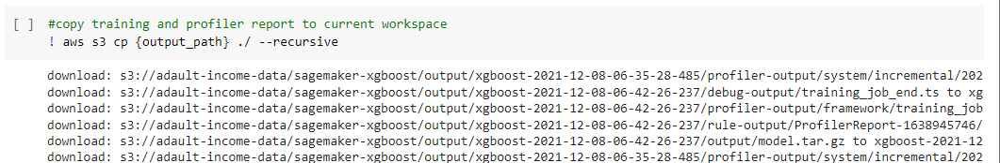

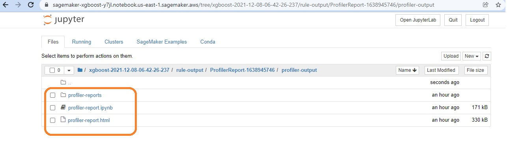

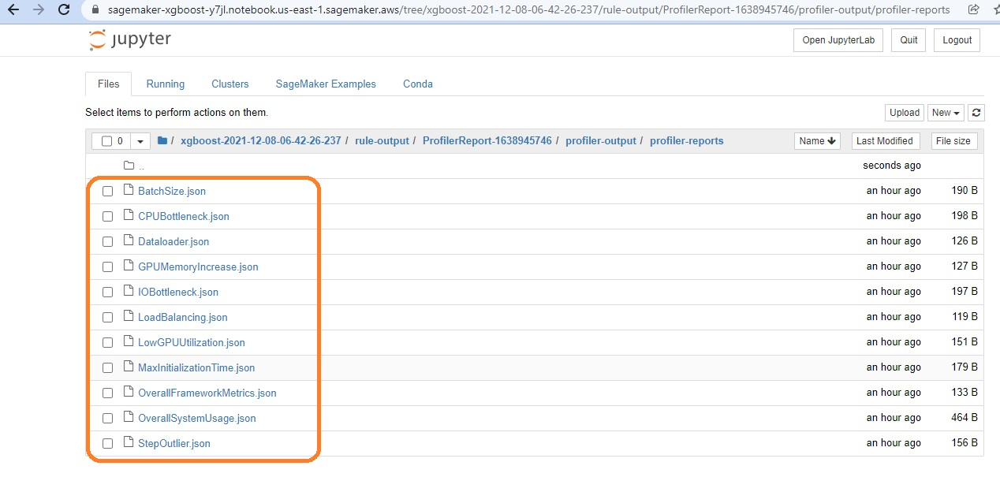

Step 7. Clean up

In this step, terminate the resources used. Not terminating resources will result in charges to your account.

a.Delete your endpoint: In your Jupyter notebook, copy and paste the following code and choose Run.

      xgb_predictor.delete_endpoint(delete_endpoint_config=True)

b.Delete training artifacts and S3 bucket: In Jupyter notebook, copy and paste the following code and choose Run.

      bucket_to_delete = boto3.resource('s3').Bucket(bucket_name)
      bucket_to_delete.objects.all().delete()
      
c.Delete SageMaker Notebook instance: Stop and delete SageMaker Notebook created.

